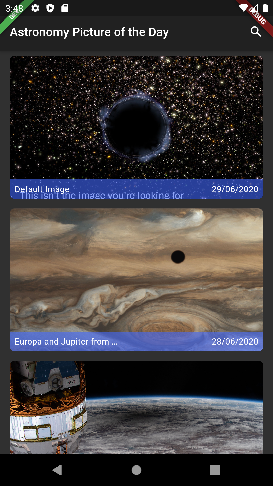
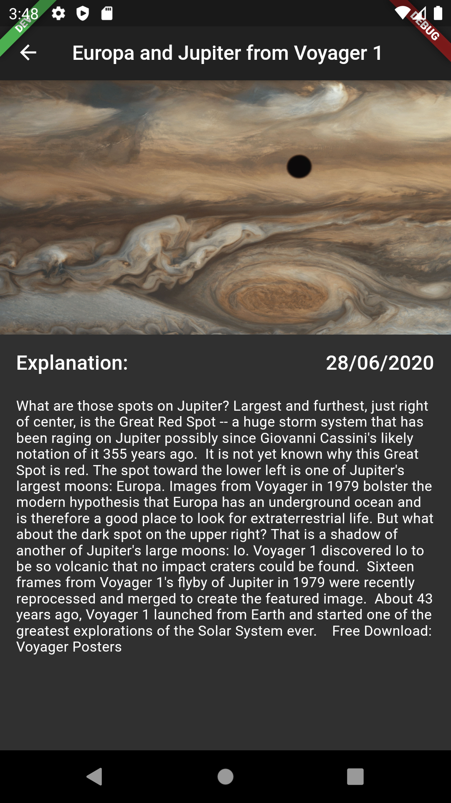
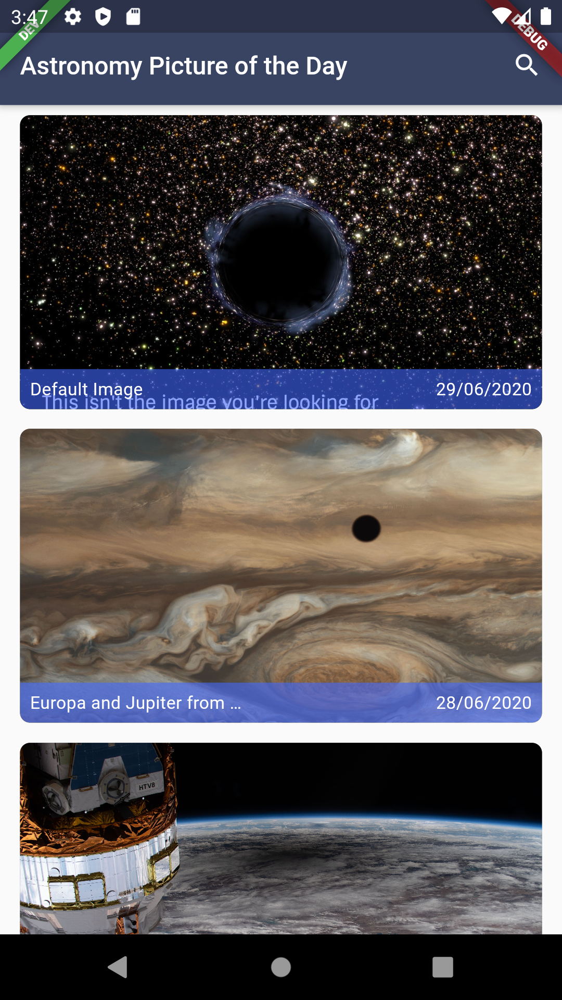
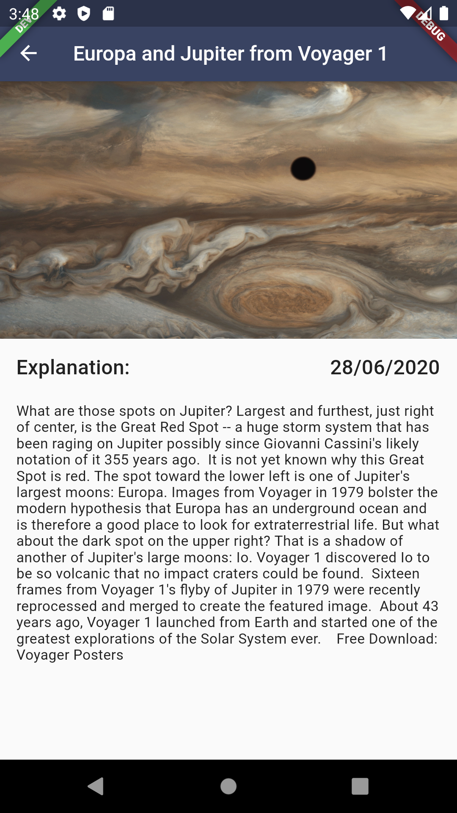
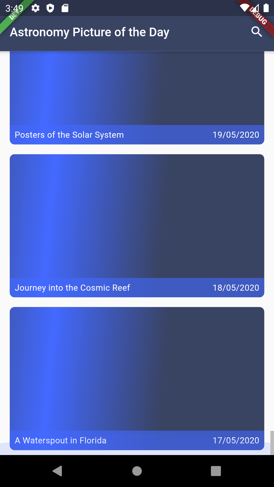
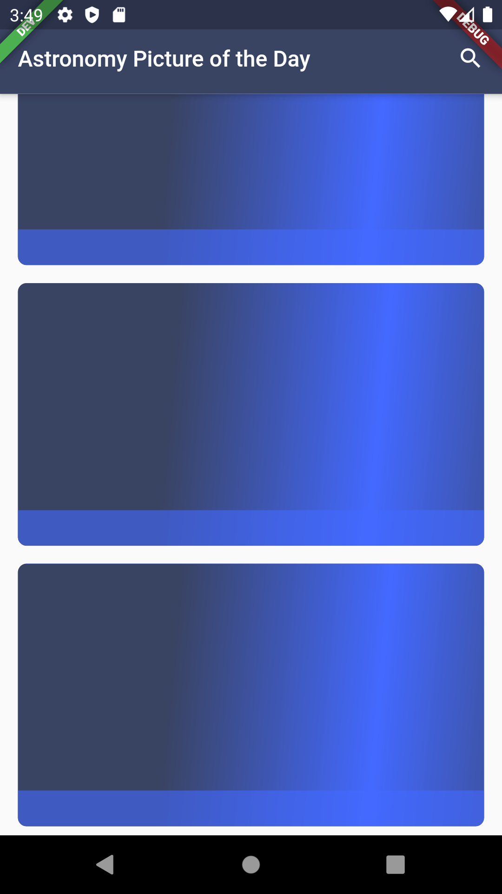
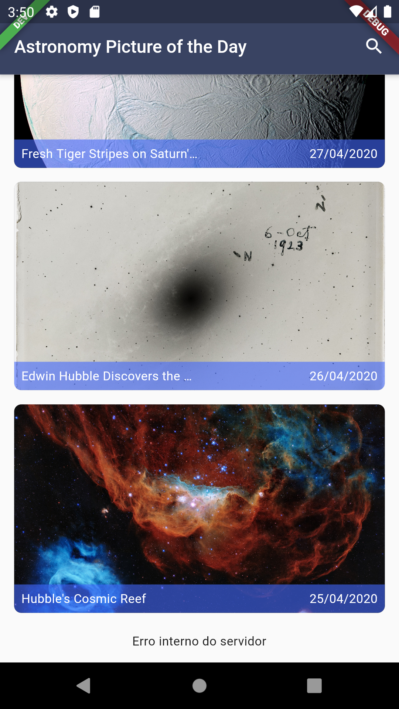

# nasa_photos

A new Flutter project. Created by Lucas Polazzo with Flutter Snow Blower

## Getting Started

This project is a starting point for a Flutter application.

A few resources to get you started if this is your first Flutter project:

- [Lab: Write your first Flutter app](https://flutter.dev/docs/get-started/codelab)
- [Cookbook: Useful Flutter samples](https://flutter.dev/docs/cookbook)

For help getting started with Flutter, view our
[online documentation](https://flutter.dev/docs), which offers tutorials,
samples, guidance on mobile development, and a full API reference.

## Theme of the app

This app was made with styles file and supports also the dark theme, according the system.

## 🎉 Download

I builded the profile mode of application, because of this, the apk sizes is significantly bigger than the release mode. If you want to use more this app, I highly recommend you to put a key in the app and follow [this tutorial](https://flutter.dev/docs/deployment/android) to download the release apk.

[DOWNLOAD HERE](./builds/app-profile.apk)

## Tests

This project is with ~90% coveraged with tests, then if you will change something os the code, adapt the test code or creates a new ones!

To test all the files simply type `flutter test`

## Screenshots

### Dark Theme

#### Home page

#### Details page

### Light Theme

#### Home page (light)

#### Details page (light)

### States of pages

#### Loading images

#### Loading list

#### Error in list

